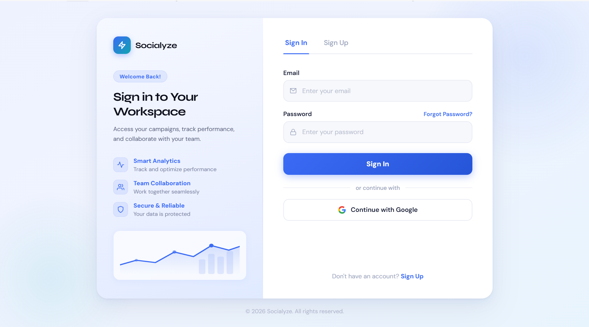
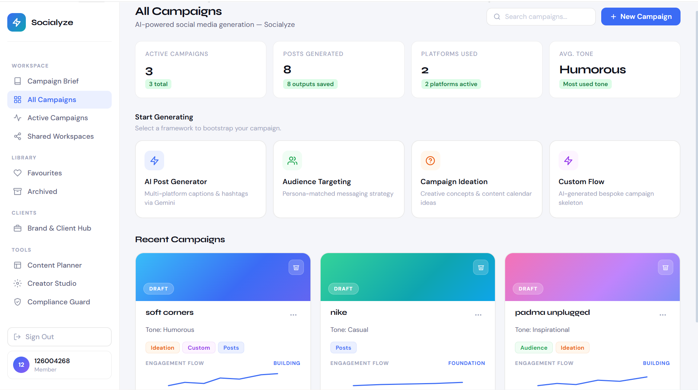
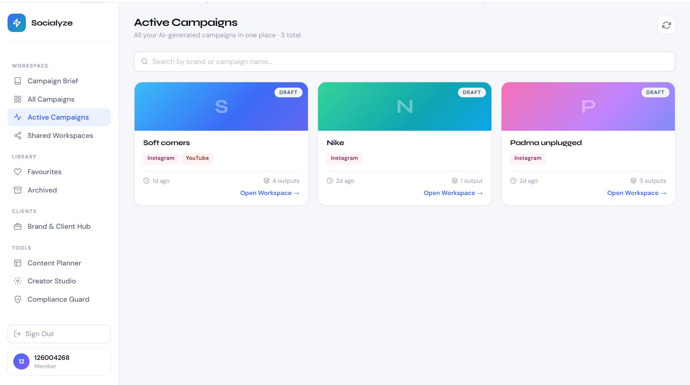
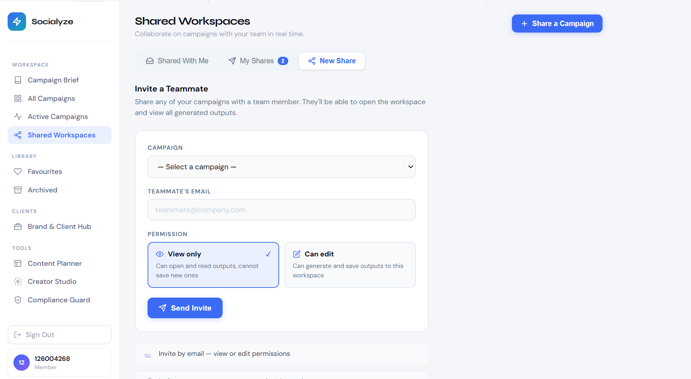
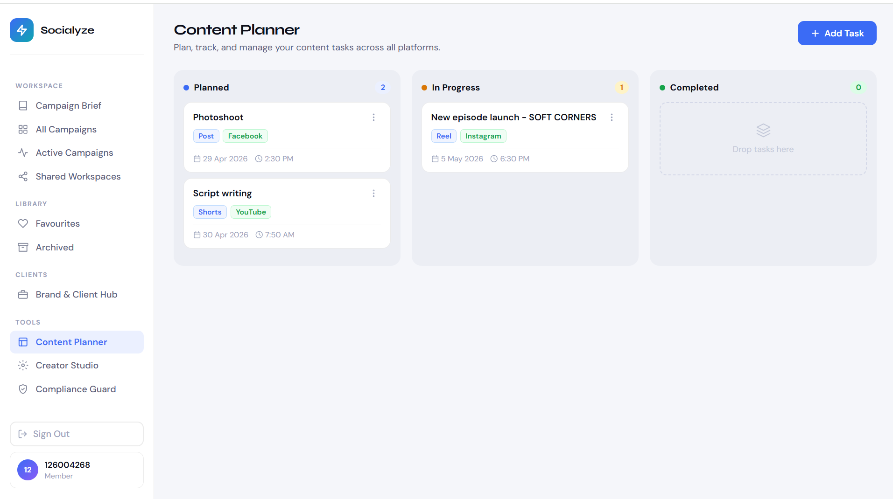
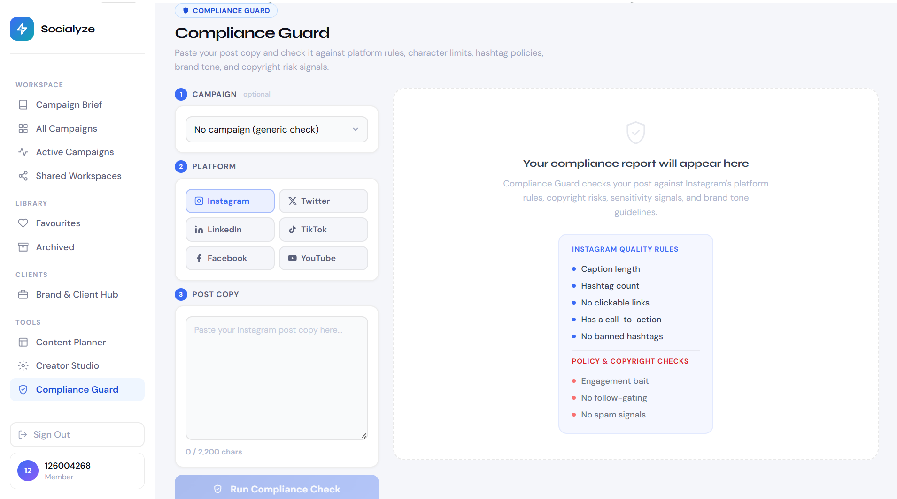

# Socialyze - AI Social Media Campaign Generator

<div align="center">

**Organisation:** Sourcesys Technologies &nbsp;|&nbsp; **Version:** 1.0.0 &nbsp;|&nbsp; **Status:** Deployed &nbsp;|&nbsp; **Licence:** MIT

**Author:** Subasri B 

**Live:** [https://socialyze-nu.vercel.app](https://socialyze-nu.vercel.app)

---

[](https://react.dev/)
[](https://vitejs.dev/)
[](https://nodejs.org/)
[](https://expressjs.com/)
[](https://console.groq.com/)
[](https://supabase.com/)
[](https://www.python.org/)
[](https://streamlit.io/)

</div>

---

## Screenshots

<table>
  <tr>
    <td align="center" width="50%">
      <strong>Sign In</strong><br/><br/>
      
      <br/><sub>Supabase-authenticated sign-in page</sub>
    </td>
    <td align="center" width="50%">
      <strong>All Campaigns Dashboard</strong><br/><br/>
      
      <br/><sub>Summary stats, service launchers, recent campaign cards</sub>
    </td>
  </tr>
  <tr>
    <td align="center" width="50%">
      <strong>Active Campaigns</strong><br/><br/>
      
      <br/><sub>All generated campaigns with platform tags and output counts</sub>
    </td>
    <td align="center" width="50%">
      <strong>Shared Workspaces</strong><br/><br/>
      
      <br/><sub>Invite teammates with View or Edit permissions</sub>
    </td>
  </tr>
  <tr>
    <td align="center" width="50%">
      <strong>Content Planner</strong><br/><br/>
      
      <br/><sub>Kanban board — Planned, In Progress, Completed</sub>
    </td>
    <td align="center" width="50%">
      <strong>Compliance Guard</strong><br/><br/>
      
      <br/><sub>Rule-based compliance checks against platform policies</sub>
    </td>
  </tr>
</table>

---

## Table of Contents

- [Project Overview](#1-project-overview)
- [System Architecture](#2-system-architecture)
- [Directory Structure](#3-directory-structure)
- [Technology Stack](#4-technology-stack)
- [AI Services](#5-ai-services)
- [Database Schema](#6-database-schema)
- [API Reference](#7-api-reference)
- [Frontend Pages and Routing](#8-frontend-pages-and-routing)
- [Machine Learning Pipeline](#9-machine-learning-pipeline)
- [Local Setup](#10-local-setup)
- [Environment Variables](#11-environment-variables)
- [Email Service](#12-email-service)
- [Deployment](#13-deployment)
- [Security Notes](#14-security-notes)
- [Team](#15-team)

---

## 1. Project Overview

Socialyze is a deployed, full-stack AI social media campaign platform built by Sourcesys Technologies. It combines a Groq-powered REST API, a React SPA with Supabase authentication, and a Python ML pipeline into a single production system that helps marketing teams generate multi-platform campaign content at scale.

**What it does:**

- Generates platform-native posts, captions, and hashtags for Instagram, Twitter/X, LinkedIn, Facebook, TikTok, and YouTube from a single brief
- Builds 3 deep audience personas with psychographics, pain points, behavioral patterns, and buying triggers
- Produces 5 campaign concepts scaled from safe-and-smart to high-risk/viral, each with a tagline, strategic logic, and first execution step
- Outputs a full campaign skeleton — name, brand voice guide, content pillars, platform strategy, weekly posting plan, ready-to-publish captions, tiered hashtag strategy, and content calendar hooks
- Generates format-specific content editing guides for Reels, Carousels, Photo Posts, Stories, YouTube Shorts, and Twitter Threads
- Runs rule-based compliance checks against Instagram, Twitter, LinkedIn, Facebook, TikTok, and YouTube platform policies
- Tracks content tasks on a Kanban board backed by Supabase
- Sends HTML collaboration invite emails via Nodemailer when workspaces are shared

**AI model:** Groq `llama-3.1-8b-instant` for the Express backend. Groq `llama-3.3-70b-versatile` for the Streamlit interface. Single call per request — no retries. If Groq fails for any reason, structured domain-specific fallback content is served so the UI always returns usable output.

---

## 2. System Architecture

### 2.1 Layers

| Layer | Technology | Deployment |
|---|---|---|
| Frontend SPA | React 18 + Vite 5, CSS Modules, Supabase JS | Vercel |
| REST API | Node.js 18 + Express 4, Groq SDK, Nodemailer | Render |
| Database | Supabase (PostgreSQL + RLS) | Supabase cloud |
| ML / Demo UI | Python 3.10, Groq Python SDK, Streamlit | Streamlit Cloud |

### 2.2 Request Flow

```
Browser (React)
  │
  ├─ Supabase JS ─────────────────────────────────────────── Supabase (PostgreSQL)
  │    auth, campaigns, outputs, content tasks, sharing
  │
  └─ fetch() → Express API (Render)
         │
         └─ POST https://api.groq.com/openai/v1/chat/completions
                ├─ Groq responds → safeParseJSON → return to client
                └─ Groq fails   → domain fallback object → return to client
```

### 2.3 Groq Integration

All generation routes call Groq using native `fetch()` with a 30-second `AbortController` timeout. The `safeParseJSON` function strips markdown fences and extracts the first valid JSON block from the raw model response. If parsing fails, `null` is returned and the route falls back to structured hardcoded content.

| Function | Returns | Used by |
|---|---|---|
| `callGroq(prompt, opts)` | Parsed JSON object or `null` | All card routes |
| `callGroqText(prompt, opts)` | Raw string or `null` | Legacy compatibility |
| `generateWithFallback(prompt, opts)` | Alias for `callGroq` | Injected to `res.locals` |

Temperature presets by task type:

| Preset | Value | Used for |
|---|---|---|
| `creative` | 1.0 | Post generation, campaign ideation, creator studio |
| `strategic` | 0.75 | Audience targeting, custom flow |
| `structured` | 0.65 | Posting plans, hashtag lists |

---

## 3. Directory Structure

```
SOCIAL MEDIA PROJECT/
├── README.md
├── requirements.txt                Python dependencies
├── package.json                    Root — dev scripts only
├── .env                            Root env (gitignored)
├── .gitignore
├── supabase_schema.sql             Core tables + RLS + auto-profile trigger
├── content_calendar_migration.sql  Content calendar table + RLS
├── shared_workspaces_migration.sql Collaboration tables + cross-user RLS
├── preprocess.py                   Dataset preprocessing pipeline
├── generate_synthetic_data.py      Synthetic data generator
├──
├── backend/
│   ├── server.js                   Express API entry point
│   ├── config.js                   Groq config, temperature presets, platform/tone/campaign-type helpers
│   ├── emailService.js             Nodemailer — SMTP invite emails (Gmail / Brevo / generic SMTP)
│   ├── test-groq.js                Groq API key tester
│   ├── package.json
│   ├── .env                        Backend env (gitignored)
│   └── routes/
│       ├── audienceTargeting.js    POST /audience-targeting — 3 psychographic personas
│       ├── campaignIdeation.js     POST /campaign-ideation — 5 campaign concepts
│       ├── customFlow.js           POST /custom-flow — full campaign skeleton
│       └── creatorStudio.js        POST /creator-studio — 6 content format guides
├──
├── frontend/
│   ├── vite.config.js              Dev proxy + build config
│   ├── index.html                  Loads DM Sans + Syne from Google Fonts
│   ├── package.json
│   ├── .env                        Frontend env (gitignored)
│   └── src/
│       ├── App.jsx                 Auth gate + lazy-loaded page router
│       ├── supabaseClient.js       Supabase singleton
│       ├── main.jsx
│       ├── lib/
│       │   ├── campaignService.js      Supabase CRUD — campaigns, outputs, brief, sharing
│       │   ├── fallbackService.js      Domain-specific fallback content (all panels)
│       │   ├── generateWithFallback.js Frontend Groq caller
│       │   └── safeParseJSON.js        JSON sanitiser for Groq responses
│       ├── components/
│       │   ├── Auth.jsx                Sign-in / sign-up
│       │   ├── Dashboard.jsx           Home dashboard
│       │   ├── Sidebar.jsx             Navigation
│       │   ├── GeneratePanel.jsx       AI Post Generator panel
│       │   ├── AudienceTargetingPanel.jsx
│       │   ├── CampaignIdeationPanel.jsx
│       │   ├── CustomFlowPanel.jsx
│       │   ├── CampaignCard.jsx
│       │   ├── FillFromBriefButton.jsx
│       │   └── QuickCampaignPanel.jsx
│       └── pages/
│           ├── CampaignWorkspace.jsx   Full workspace view
│           ├── ActiveCampaignsPage.jsx
│           ├── CampaignBriefPage.jsx
│           ├── ContentPlannerPage.jsx  Kanban board
│           ├── CreatorStudioPage.jsx
│           ├── ComplianceGuardPage.jsx
│           ├── ExportPanel.jsx         PDF export modal
│           ├── BrandsPage.jsx
│           ├── SharedWorkspacesPage.jsx
│           ├── FavouritesPage.jsx
│           ├── ArchivedPage.jsx
│           └── TeamPage.jsx
├──
├── streamlit_app/
│   └── app.py                  Streamlit UI — mirrors full React app, uses llama-3.3-70b-versatile
├──
├── ml/                         ML pipeline modules
├── training/
│   └── train.py                DistilBERT fine-tuning
├── evaluation/
│   └── evaluate.py             Accuracy, F1, BLEU evaluation
├── scripts/
│   └── evaluator.js            Node.js metric utilities
├── config/
│   └── settings.py             Centralised Python configuration
├── docs/
│   ├── PREPROCESSING.md
│   └── screenshots/
└── data/
    ├── raw/                    Raw datasets (gitignored)
    ├── processed/              Cleaned CSVs, train/test splits, hashtag map
    ├── models/                 DistilBERT weights (gitignored)
    └── evaluation/             evaluation_report.json, metrics_summary.csv
```

---

## 4. Technology Stack

| Technology | Version | Role |
|---|---|---|
| React | 18.2.0 | Frontend SPA, CSS Modules, lazy-loaded routing |
| Vite | 5.0.0 | Build tool, dev server, API proxy |
| @supabase/supabase-js | 2.103.0 | Auth, session management, database client |
| Express | 4.19.2 | REST API server |
| Groq API (`llama-3.1-8b-instant`) | — | LLM for all backend generation |
| Groq API (`llama-3.3-70b-versatile`) | — | LLM for Streamlit interface |
| Nodemailer | 8.0.5 | SMTP invite email dispatch |
| Supabase (PostgreSQL) | Managed | Relational DB with Row Level Security |
| Python | 3.10+ | ML pipeline |
| HuggingFace Transformers | 4.40.0 | DistilBERT fine-tuning |
| Scikit-learn | 1.4.0 | Label encoding, train/test split, metrics |
| NLTK | 3.8.1 | Tokenisation, stopword removal, BLEU score |
| Pandas | 2.0.0 | Dataset preprocessing |
| Streamlit | 1.32.0 | Python UI — mirrors full React app |

---

## 5. AI Services

Socialyze exposes four distinct AI services, each backed by a dedicated Express route with its own prompt builder, structured output schema, and domain-specific fallback.

### AI Post Generator (`POST /generate-post`)

Generates 3 post variations, 3 caption variations, 10 hashtags, and a CTA for a single platform. Inputs: brand name, product, campaign goal, target audience, key message, CTA, tone, platform. Prompt is hook-first and platform-aware. Fallback: 3 fully formed posts using the brand and product inputs.

### Audience Targeting (`POST /audience-targeting`)

Generates 3 psychographic personas. Each persona includes:
- `persona_name` — first name plus a psychological archetype (e.g. "Meera — The Quietly Burnt-Out Overachiever")
- `description` — 2 sentences on their life and specific frustration
- `motivations` — 3 identity-driven desires
- `pain_points` — 3 visceral friction moments
- `behavior` — platform habits, what they save and share
- `content_preferences` — 3 specific format types they stop for
- `buying_trigger` — the single moment that converts them

Fallback delivers 3 fully written personas ("The Efficiency Hunter", "The Quietly Sceptical Researcher", "The Identity-Driven Early Adopter") scoped to the brand's region and product.

### Campaign Ideation (`POST /campaign-ideation`)

Generates 5 campaign concepts scaled from safe-and-smart (#1) to high-risk viral (#5). Each concept includes `title`, `tagline`, `idea`, `why_it_works`, and a tactical `execution` — written as the actual first piece of content, not a description of it. Fallback delivers 5 complete concepts including "The Anti-Campaign" and "Radical Honesty" frameworks.

### Custom Flow (`POST /custom-flow`)

Produces the most comprehensive output in the system: a full campaign skeleton including `campaign_name`, `campaign_summary`, `brand_voice_guide` (4 DO/NEVER directives), 5 `content_pillars` with examples, per-platform `platform_strategy`, a `posting_plan` with tactical notes per week, 6 publish-ready `sample_captions`, a tiered `hashtag_strategy` (brand / trend / niche), and 8 `calendar_hooks`. Fallback outputs a complete 4-week posting plan with real post ideas.

### Creator Studio (`POST /creator-studio`)

Reads campaign context and generates a publish-ready editing guide for 6 content formats. Format is auto-detected from a `contentHint` string using keyword matching.

| Format | Detected keywords | Output |
|---|---|---|
| Reel | reel, tiktok, video, clip | `reelScript` with hook, 3 scenes, CTA |
| Carousel | carousel, slide, swipe, document | `carouselSlides` — 5 slides with headline, body, visual direction |
| Photo | post, photo, image, static, infograph | `photoPost` with image direction and caption |
| Story | story, stories | `storyFrames` — 3 frames at 0-4s, 4-11s, 11-15s |
| Short | short, youtube short, yt short | `reelScript` at 60s max |
| Thread | thread, tweet thread | `twitterThread` — 5 tweets |

Every response also includes `editingInstructions` (5 CapCut or Canva steps with exact menu paths), `canvaLayout` (dimensions, fonts with real font names, hex colors, placement), `thumbnailIdea`, and `mistakesToAvoid` (3 specific to the brand and format).

### Multi-Platform Generator (`POST /generate`)

Called by the main Generate Panel. Takes a campaign brief and a list of platforms, returns per-platform `post`, `caption`, and `hashtags[]` in a single response. Platform-native prompt rules injected from `config.js` for each target platform.

---

## 6. Database Schema

All tables live in Supabase's `public` schema with Row Level Security enforced at the SQL policy level. Three migration files must be executed in order.

**Execute in Supabase Dashboard → SQL Editor → New Query:**

```
1. supabase_schema.sql             — Core tables + RLS + auto-profile trigger
2. content_calendar_migration.sql  — Content calendar table + per-user RLS
3. shared_workspaces_migration.sql — Collaboration tables + cross-user RLS
```

| Table | Key Columns | Notes |
|---|---|---|
| `profiles` | `id`, `full_name`, `email`, `avatar_url` | Auto-created via trigger on `auth.users` INSERT |
| `campaigns` | `id` (UUID), `user_id`, `campaign_name`, `status`, `platforms[]`, `tone` | `status`: Draft / Active / Archived. Unique on `(user_id, campaign_name)` |
| `campaign_outputs` | `campaign_id`, `output_type`, `generated_data` (JSONB) | `output_type` constrained to: `post_generator`, `audience`, `ideation`, `custom_flow` |
| `content_calendar` | `title`, `task_type`, `platform`, `date`, `time`, `status` | `status`: Planned / In Progress / Completed. Optionally linked to a campaign |
| `shared_workspaces` | `campaign_id`, `owner_id`, `invitee_email`, `permission`, `status` | `permission`: view / edit. `status`: pending / accepted. Unique on `(campaign_id, invitee_email)` |

---

## 7. API Reference

All POST endpoints accept `Content-Type: application/json` and return JSON. The server injects `callGroqJSON`, `callGroqText`, and `generateWithFallback` into `res.locals` at the middleware layer so route modules access Groq without direct imports.

### Endpoints

| Method | Path | Description |
|---|---|---|
| GET | `/health` | Server status, LLM provider, model name, API key loaded flag |
| POST | `/generate` | Multi-platform generator — returns `{ [platform]: { post, caption, hashtags[] } }` |
| POST | `/generate-post` | Single-platform AI post generator — returns `post_variations[]`, `caption_variations[]`, `hashtags[]`, `cta` |
| POST | `/audience-targeting` | 3 psychographic personas with full behavioral profiles |
| POST | `/campaign-ideation` | 5 campaign concepts from safe to viral |
| POST | `/custom-flow` | Full campaign skeleton: pillars, strategy, posting plan, captions, hashtags, calendar hooks |
| POST | `/creator-studio` | Platform-specific editing guide for 6 content formats |
| POST | `/send-invite` | Sends HTML collaboration invite via SMTP. Accepts `toEmail`, `ownerEmail`, `campaignName`, `permission` |

### Required Fields per Endpoint

**POST /generate**
`campaign_name`, `campaign_goal`, `platforms[]`

**POST /generate-post**
`brand_name`, `campaign_goal`, `product_or_service`, `target_audience`, `key_message`, `call_to_action`

**POST /audience-targeting**
`brand_name`, `product_or_service`, `campaign_objective`, `industry`, `age_group`, `region`, `customer_type`, `pain_points`

**POST /campaign-ideation**
`brand_name`, `product_or_service`, `campaign_goal`, `target_audience`, `tone`, `season_or_event`, `platform_focus`

**POST /custom-flow**
`brand_name`, `product_or_service`, `business_objective`, `target_audience`, `tone`, `platforms[]`, `campaign_duration`, `key_message`, `call_to_action`

**POST /creator-studio**
Body: `{ ctx: { campaignName, platforms[], tone, contentHint, ... } }`

**POST /send-invite**
`toEmail`, `ownerEmail`, `campaignName`, `permission` (view / edit)

### Health Check Response Example

```json
{
  "status": "healthy",
  "timestamp": "2025-06-01T10:30:00.000Z",
  "llmProvider": "Groq",
  "groqModel": "llama-3.1-8b-instant",
  "apiKeyLoaded": true,
  "retries": "none — single call per request"
}
```

---

## 8. Frontend Pages and Routing

`App.jsx` manages all client-side navigation via a single `activeNav` state string — no React Router. All pages are lazy-loaded with `React.lazy` and `Suspense`. Auth state is resolved asynchronously on mount via `supabase.auth.getSession()`; the app renders a spinner until confirmed.

| Route Key | Page | Description |
|---|---|---|
| `campaigns` (default) | Dashboard | Stats, 4 service launcher cards, recent campaigns |
| `brief` | Campaign Brief | Optional default brief that pre-fills all service forms |
| `active` | Active Campaigns | All saved campaigns with search |
| `planner` | Content Planner | Kanban board — Planned / In Progress / Completed |
| `fav` | Favourites | Starred campaigns |
| `archived` | Archived | Archived campaigns |
| `shared` | Shared Workspaces | Incoming shares + outgoing shares + invite form |
| `brands` | Brand & Client Hub | Brand profiles with tone, industry, platforms, color |
| `team` | Team | Current member — team collaboration coming soon |
| `creator` | Creator Studio | Editing guide generator for 6 content formats |
| `compliance` | Compliance Guard | Rule-based caption compliance checker |

### Frontend Service Library (`src/lib/`)

| Module | Responsibility |
|---|---|
| `campaignService.js` | All Supabase operations — save/fetch campaigns, outputs, brief, sharing |
| `fallbackService.js` | Structured fallback content for all panels when Groq is unavailable. Never returns null |
| `generateWithFallback.js` | Browser-side Groq caller. Single call, returns parsed JSON or null |
| `safeParseJSON.js` | Strips markdown fences, extracts first JSON block, handles malformed output |

### Compliance Guard — Platform Rule Coverage

| Platform | Rules checked |
|---|---|
| Instagram | Caption ≤ 2,200 chars, ≤ 30 hashtags, no clickable links in caption, CTA present |
| Twitter/X | Tweet ≤ 280 chars, ≤ 2 hashtags, strong opening hook |
| LinkedIn | Post ≤ 3,000 chars, ≤ 5 hashtags, professional tone (no slang) |
| Facebook | Post ≤ 63,206 chars, CTA present |
| TikTok | Caption ≤ 2,200 chars, 3–8 hashtags, caption not empty |
| YouTube | Title ≤ 100 chars, ≥ 5 words in description, CTA present |

---

## 9. Machine Learning Pipeline

The ML pipeline is a standalone Python workflow for tone classification. It runs independently of the web application.

### Pipeline Stages

| Stage | Script | Description |
|---|---|---|
| 1. Preprocessing | `preprocess.py` | Unifies 6 raw datasets into a 9-column schema. NLTK cleaning, Scikit-learn label encoding, train/test split |
| 2. Synthetic data | `generate_synthetic_data.py` | Augments underrepresented tone classes |
| 3. Training | `training/train.py` | Fine-tunes `distilbert-base-uncased` for 5-class tone classification |
| 4. Evaluation | `evaluation/evaluate.py` | Accuracy, Precision, Recall, F1 Score, BLEU Score against held-out test set |
| 5. Demo UI | `streamlit_app/app.py` | Streamlit interface — mirrors full React app using Groq `llama-3.3-70b-versatile` |

### Dataset

| Metric | Value |
|---|---|
| Total rows (post-preprocessing) | 4,566 |
| Training set | 3,652 rows (80%) |
| Test set | 914 rows (20%) |
| Tone classes | 5 — Casual, Professional, Inspirational, Humorous, Urgent |
| Hashtag map topics | 26 |

### Training Configuration

| Parameter | Value |
|---|---|
| Base model | `distilbert-base-uncased` |
| Max token length | 128 |
| Batch size | 8 |
| Epochs | 3 |
| Learning rate | 2e-5 |
| Test split | 0.20 |

### Raw Datasets Required

Place all files in `data/raw/text/` before running `preprocess.py`. These are gitignored.

| Filename | Source |
|---|---|
| `enriched_posts.json` | Kaggle — LinkedIn enriched posts |
| `Instagram_Reels_Data_Cleaned.csv` | Kaggle — Instagram Reels engagement |
| `sentimentdataset.csv` | Kaggle — Social media sentiment |
| `Social_Media_Advertising.csv` | Kaggle — Social media advertising |
| `manual_dataset.csv` | Manual curation — platform-specific annotated posts |
| `image_dataset.csv` | Manual — visual style annotations |

---

## 10. Local Setup

### Prerequisites

- Node.js 18 or later
- Groq API key — free from [console.groq.com](https://console.groq.com)
- Supabase project — free tier at [supabase.com](https://supabase.com)
- Python 3.10 or later (ML pipeline only)

### Start the Backend

```bash
cd backend
npm install
npm run dev        # nodemon hot-reload on port 3000
```

### Start the Frontend

```bash
cd frontend
npm install
npm run dev        # Vite dev server on port 5173
```

Dev proxy in `vite.config.js` forwards all `/generate*`, `/audience-targeting`, `/campaign-ideation`, `/custom-flow`, `/creator-studio`, `/send-invite`, and `/health` requests to `http://localhost:3000` — no CORS issues in development.

### Test the Groq API Key

```bash
cd backend
node test-groq.js
```

### Provision Supabase

In **Supabase Dashboard → SQL Editor → New Query**, execute in order:

```sql
-- 1
\i supabase_schema.sql
-- 2
\i content_calendar_migration.sql
-- 3
\i shared_workspaces_migration.sql
```

### Run the ML Pipeline (optional)

```bash
pip install -r requirements.txt
python preprocess.py
python training/train.py
python evaluation/evaluate.py
streamlit run streamlit_app/app.py
```

---

## 11. Environment Variables

### Backend (`backend/.env`)

| Variable | Required | Description |
|---|---|---|
| `GROQ_API_KEY` | ✅ | Groq API key from [console.groq.com/keys](https://console.groq.com/keys) |
| `PORT` | — | Express port (default: `3000`) |
| `APP_URL` | — | Frontend URL for invite email links (default: `http://localhost:5173`) |
| `EMAIL_PROVIDER` | — | `gmail` / `brevo` / `smtp` (default: `gmail`) |
| `GMAIL_USER` | — | Gmail address |
| `GMAIL_APP_PASS` | — | 16-char Gmail App Password |
| `BREVO_SMTP_USER` | — | Brevo login email |
| `BREVO_SMTP_KEY` | — | Brevo SMTP key |
| `SMTP_HOST` | — | Generic SMTP host |
| `SMTP_PORT` | — | Generic SMTP port (default: `587`) |
| `SMTP_USER` | — | Generic SMTP username |
| `SMTP_PASS` | — | Generic SMTP password |
| `EMAIL_FROM_NAME` | — | Sender display name (default: `Socialyze`) |
| `EMAIL_FROM_EMAIL` | — | Sender email address |

### Frontend (`frontend/.env`)

| Variable | Required | Description |
|---|---|---|
| `VITE_SUPABASE_URL` | ✅ | Supabase project URL |
| `VITE_SUPABASE_ANON_KEY` | ✅ | Supabase anon (public) key |
| `VITE_API_URL` | ✅ | Backend base URL (Render URL in production) |
| `VITE_GROQ_API_KEY` | — | Groq key for direct browser calls (fallback path only) |

> In production, route all AI calls through the backend and remove `VITE_GROQ_API_KEY` from the frontend bundle.

---

## 12. Email Service

Collaboration invites are sent via [Nodemailer](https://nodemailer.com/) with a configurable SMTP transport. The service verifies its connection on startup and logs a warning if misconfigured — it does not crash the server.

| Provider | Notes |
|---|---|
| Gmail App Password | Enable 2-Step Verification → generate App Password at `myaccount.google.com/apppasswords`. Set `EMAIL_PROVIDER=gmail`. |
| Brevo SMTP | 300 free emails/day, no domain verification required. Set `EMAIL_PROVIDER=brevo`. |
| Generic SMTP | Mailgun, Postmark, or any standard SMTP. Set `EMAIL_PROVIDER=smtp`. |

The invite email is an HTML template with the campaign name, sharing owner, permission level, and a CTA button linking to the deployed app URL.

---

## 13. Deployment

### Backend — Render

- Root directory: `backend/`
- Build command: `npm install`
- Start command: `node server.js`
- Set all backend environment variables in Render's environment panel
- Set `APP_URL` to the deployed Vercel frontend URL

### Frontend — Vercel

- Root directory: `frontend/`
- Build command: `npm run build`
- Output directory: `dist/`
- Set `VITE_SUPABASE_URL`, `VITE_SUPABASE_ANON_KEY`, `VITE_API_URL` (Render backend URL), and optionally `VITE_GROQ_API_KEY` as Vercel environment variables

### Streamlit — Streamlit Cloud

- Point to `streamlit_app/app.py` in the repository root
- Add `GROQ_API_KEY` under **Settings → Secrets** as `GROQ_API_KEY = "gsk_..."`
- Confirm `data/raw/` and `data/models/` are gitignored before pushing

---

## 14. Security Notes

- All `.env` files are gitignored at root, `backend/`, and `frontend/` level. Never commit API keys.
- `data/raw/` is gitignored. Raw datasets may contain personal or licensed data.
- `data/models/tone_classifier/` is gitignored due to binary file size.
- All Supabase tables enforce Row Level Security. Users cannot read, write, or delete rows they do not own.
- The Express backend validates all required fields on every POST endpoint and returns HTTP 400 before any AI call is made.
- CORS is permissive by default. For production, restrict the origin: `cors({ origin: 'https://socialyze-nu.vercel.app' })`.
- `VITE_GROQ_API_KEY` is bundled into the browser build if set. Prefer proxying all AI calls through the backend in production.

---

## 15. Team

Subasri B | Gawtham Krishnan | Vinjarappu Ajay Kumar | Ashwin D

---

**Socialyze — Sourcesys Technologies** &nbsp;·&nbsp; MIT Licence &nbsp;·&nbsp; [socialyze-nu.vercel.app](https://socialyze-nu.vercel.app)
